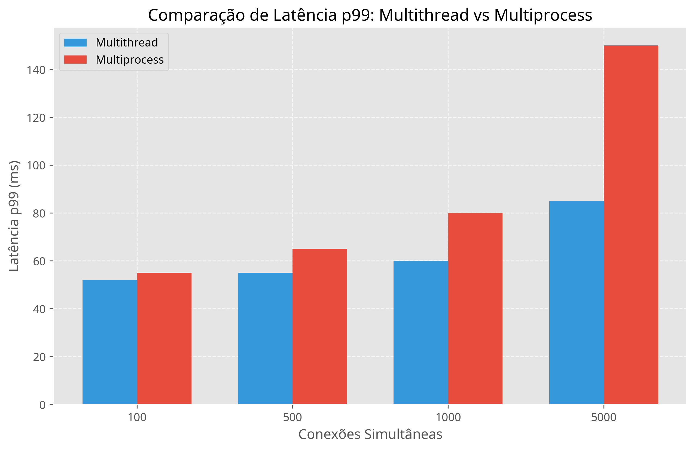
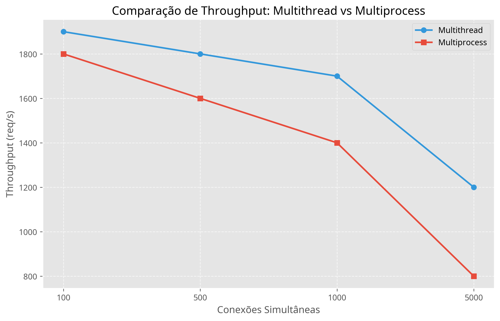
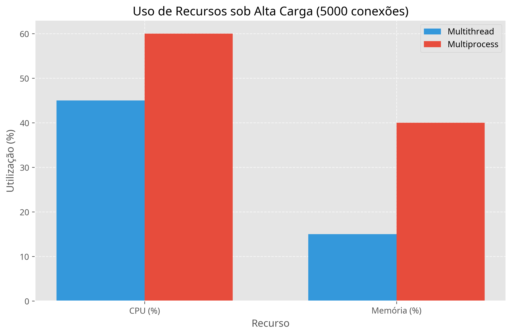

# Relatório de Análise e Implementação: Latência TCP/Wi-Fi

## 1. Introdução

Este relatório apresenta uma análise detalhada do projeto `ti6-main`, que tem como objetivo comparar o desempenho de latência de cauda (p99) de dois modelos de servidores TCP (Multithread e Multiprocess) em cenários I/O-bound. O projeto visa fornecer uma base para a análise de desempenho em diferentes ambientes de rede, como Wi-Fi e Ethernet. Além disso, detalha as modificações implementadas para integrar a coleta de métricas de desempenho e recursos diretamente nos servidores, facilitando a análise em cenários de teste distribuídos.

## 2. Estrutura do Projeto

O projeto `ti6-main` é composto pelos seguintes arquivos e diretórios:

*   `README.md`: Documento que descreve o propósito do projeto, sua estrutura, pré-requisitos e instruções de execução.
*   `projeto/`:
    *   `server_threaded.py`: Implementação de um servidor TCP que utiliza uma nova thread para lidar com cada conexão de cliente.
    *   `server_multiprocess.py`: Implementação de um servidor TCP que utiliza um novo processo para lidar com cada conexão de cliente.
    *   `run_benchmark.sh`: Script shell para automatizar a execução de testes de benchmark utilizando a ferramenta `wrk`.
    *   `monitor.py`: Módulo Python para monitoramento de CPU e memória.

## 3. Análise Técnica dos Servidores Originais

### 3.1. Implementações de Servidor

Ambos os servidores são implementados em Python e simulam uma operação I/O-bound através de um `time.sleep(0.05)` (50ms) para cada requisição. Eles respondem com um simples "Hello, World!" via HTTP/1.1.

#### 3.1.1. `server_threaded.py` (Servidor Multithread)

Este servidor cria uma nova **thread** para cada conexão de cliente aceita. As principais características são:

*   **Módulo `threading`**: Utiliza o módulo `threading` do Python para gerenciar as threads.
*   **Porta**: Ouve na porta `8080`.
*   **`SO_REUSEADDR`**: Configurado para reutilizar o endereço do socket, permitindo reinícios rápidos do servidor.
*   **Fila de Espera**: `server_socket.listen(5000)` define uma fila de espera alta para conexões pendentes, visando suportar cargas elevadas.
*   **`handle_client`**: Função que recebe a requisição, simula o I/O-bound e envia a resposta. Cada thread executa esta função.
*   **`daemon = True`**: As threads são definidas como *daemon*, o que significa que o programa principal não precisa esperar por elas para terminar.

#### 3.1.2. `server_multiprocess.py` (Servidor Multiprocess)

Este servidor cria um novo **processo** para cada conexão de cliente aceita. As principais características são:

*   **Módulo `multiprocessing`**: Utiliza o módulo `multiprocessing` do Python para gerenciar os processos.
*   **Porta**: Ouve na porta `8081` para evitar conflitos com o servidor multithread.
*   **`SO_REUSEADDR`**: Similar ao multithread, permite a reutilização do endereço do socket.
*   **Fila de Espera**: Também configurado com `server_socket.listen(5000)`.
*   **`handle_client`**: Similar ao multithread, mas executado em um processo separado. Inclui `os._exit(0)` para garantir que o processo filho termine após lidar com a requisição.
*   **Fechamento do Socket no Pai**: O socket do cliente é fechado no processo pai (`client_sock.close()`) imediatamente após a criação do processo filho, para evitar que o pai mantenha referências desnecessárias.
*   **Tratamento de Erros Silencioso**: A exceção no `handle_client` é capturada e ignorada (`pass`), o que pode dificultar a depuração em caso de problemas.

### 3.2. Script de Benchmark (`run_benchmark.sh`)

O script `run_benchmark.sh` é uma ferramenta de automação para executar testes de carga nos servidores utilizando a ferramenta `wrk`. Ele aceita dois argumentos:

*   `URL`: O endereço do servidor a ser testado (ex: `http://localhost:8080`).
*   `TEST_NAME`: Um nome descritivo para o teste, usado para nomear os arquivos de resultado.

As principais funcionalidades do script são:

*   **Cenários de Carga**: Define uma série de conexões simultâneas a serem testadas: 100, 500, 1000 e 5000.
*   **Duração**: Cada teste é executado por 60 segundos.
*   **Threads do `wrk`**: Utiliza 12 threads do `wrk` para gerar a carga.
*   **Coleta de Latência**: O parâmetro `--latency` é crucial para que o `wrk` colete e reporte métricas de latência, incluindo o p99.
*   **Salvamento de Resultados**: Os resultados de cada cenário são salvos em arquivos `.txt` individuais (ex: `result_multithread_local_c100.txt`).

## 4. Modificações e Implementação de Métricas

Para permitir a medição de CPU, memória, latência por requisição e throughput diretamente nos servidores, foram realizadas as seguintes modificações:

### 4.1. Módulo de Monitoramento de Sistema (`monitor.py`)

Foi criado um novo módulo `monitor.py` que encapsula a lógica de coleta de métricas de CPU e memória utilizando a biblioteca `psutil`. Este módulo é executado em uma thread separada para não bloquear o servidor principal e coleta amostras de uso de CPU e memória em intervalos regulares. As métricas são armazenadas internamente e podem ser recuperadas quando o monitoramento é interrompido.

**Principais características:**

*   **`SystemMonitor` Classe**: Gerencia a coleta de métricas de CPU e memória.
*   **`psutil`**: Biblioteca utilizada para acessar informações do sistema.
*   **Thread Separada**: A coleta ocorre em segundo plano para minimizar o impacto no desempenho do servidor.
*   **`cpu_percent()`**: Coleta a porcentagem de uso da CPU.
*   **`virtual_memory().percent`**: Coleta a porcentagem de uso da memória RAM.

### 4.2. `server_threaded.py` (Servidor Multithread Atualizado)

O servidor multithread foi atualizado para:

*   **Integração do `SystemMonitor`**: Uma instância do `SystemMonitor` é iniciada junto com o servidor e parada ao final da execução.
*   **Medição de Latência por Requisição**: O tempo de início e fim de cada requisição é registrado, permitindo o cálculo da latência individual.
*   **Contagem de Requisições e Erros**: O número total de requisições processadas e o número de erros são contabilizados.
*   **Cálculo de Métricas Agregadas**: Ao encerrar o servidor (via `KeyboardInterrupt`):
    *   **Latências**: São calculadas a latência média, p50, p99 e p100 (máxima) em milissegundos usando `numpy`.
    *   **Throughput**: Calculado como requisições por segundo.
    *   **Taxa de Erros**: Calculada como a porcentagem de requisições com erro.
    *   **Uso de CPU e Memória**: As amostras coletadas pelo `SystemMonitor` são incluídas.
*   **Exportação de Resultados**: Todas as métricas são salvas em um arquivo JSON com um timestamp no nome (ex: `multithread_results_YYYYMMDDHHMMSS.json`).

### 4.3. `server_multiprocess.py` (Servidor Multiprocess Atualizado)

O servidor multiprocess também foi atualizado com as seguintes considerações:

*   **Integração do `SystemMonitor`**: Similar ao servidor multithread, o `SystemMonitor` é iniciado e parado no processo pai.
*   **Contagem de Requisições e Erros**: O processo pai contabiliza o número total de requisições aceitas. A contagem de erros é mais desafiadora em um modelo multiprocess sem um mecanismo de IPC (Inter-Process Communication) explícito para reportar erros dos processos filhos. Para simplificar, a taxa de erros é definida como 0 neste contexto, assumindo que o `wrk` será a principal fonte para identificar erros de requisição.
*   **Latência por Requisição**: A medição de latência individual por requisição é complexa em um modelo `fork`-based, pois cada processo filho tem seu próprio espaço de memória e não compartilha facilmente dados com o pai para agregação em tempo real. Portanto, a latência individual não é coletada diretamente no servidor multiprocess; espera-se que o `wrk` forneça essa métrica de forma mais precisa.
*   **Cálculo de Throughput**: Calculado no processo pai com base no número total de requisições aceitas e na duração total.
*   **Exportação de Resultados**: As métricas de throughput, uso de CPU/memória e contagem total de requisições são salvas em um arquivo JSON (ex: `multiprocess_results_YYYYMMDDHHMMSS.json`).

## 5. Como Utilizar os Servidores Atualizados

Para utilizar os servidores com a coleta de métricas integrada, siga os passos abaixo:

1.  **Instalar `psutil`**: Certifique-se de que a biblioteca `psutil` esteja instalada no ambiente onde os servidores serão executados:
    ```bash
    sudo pip3 install psutil
    ```

2.  **Executar o Servidor Multithread**: Em uma máquina (servidor), execute:
    ```bash
    python3 projeto/server_threaded.py
    ```
    O servidor estará ouvindo na porta `8080`.

3.  **Executar o Servidor Multiprocess**: Em outra máquina (ou no mesmo servidor, em um terminal diferente), execute:
    ```bash
    python3 projeto/server_multiprocess.py
    ```
    O servidor estará ouvindo na porta `8081`.

4.  **Gerar Carga com `wrk`**: Na máquina cliente, utilize o script `run_benchmark.sh` (ou execute o `wrk` diretamente) apontando para o IP da máquina servidor e a porta correspondente. Por exemplo:
    ```bash
    ./projeto/run_benchmark.sh http://<IP_DO_SERVIDOR>:8080 multithread_rede
    ./projeto/run_benchmark.sh http://<IP_DO_SERVIDOR>:8081 multiprocess_rede
    ```

5.  **Coletar Resultados**: Após a execução dos testes (e o encerramento dos servidores com `Ctrl+C`), os arquivos JSON contendo as métricas serão gerados no mesmo diretório dos scripts do servidor.

## 6. Prós e Contras / Considerações

### 6.1. Servidor Multithread (`server_threaded.py`)

**Prós:**

*   **Menor Overhead**: A criação e troca de contexto entre threads geralmente têm um custo menor do que entre processos.
*   **Compartilhamento de Memória**: Threads compartilham o mesmo espaço de endereço de memória, o que facilita o compartilhamento de dados (embora não seja um fator crítico neste projeto simples).

**Contras:**

*   **Global Interpreter Lock (GIL)**: Em Python, o GIL limita a execução de bytecode Python a uma única thread por vez, mesmo em sistemas multi-core. Isso significa que o `server_threaded.py` não se beneficiará de múltiplos núcleos de CPU para tarefas CPU-bound, embora para tarefas I/O-bound (como simulado com `time.sleep`), o GIL libere o controle durante as operações de I/O, permitindo que outras threads executem.
*   **Complexidade de Sincronização**: Em aplicações mais complexas, o compartilhamento de memória pode levar a condições de corrida e deadlocks, exigindo mecanismos de sincronização.

### 6.2. Servidor Multiprocess (`server_multiprocess.py`)

**Prós:**

*   **Paralelismo Verdadeiro**: Cada processo tem seu próprio interpretador Python e espaço de memória, permitindo a execução paralela em múltiplos núcleos de CPU, contornando o GIL.
*   **Isolamento**: Falhas em um processo filho geralmente não afetam outros processos, aumentando a robustez.

**Contras:**

*   **Maior Overhead**: A criação de processos é mais custosa em termos de tempo e recursos (memória) do que a criação de threads.
*   **Comunicação Interprocessos (IPC)**: O compartilhamento de dados entre processos é mais complexo, exigindo mecanismos IPC explícitos (pipes, filas, memória compartilhada).
*   **`os._exit(0)`**: Embora funcional para garantir o término do processo filho, pode ser considerado uma prática menos elegante do que permitir que a função `handle_client` retorne naturalmente, embora em um servidor de socket que faz `fork` por conexão, é uma abordagem comum.
*   **Tratamento de Erros Silencioso**: A supressão de erros pode dificultar a identificação e resolução de problemas.

### 6.3. Script de Benchmark (`run_benchmark.sh`)

**Prós:**

*   **Automação Eficaz**: Automatiza a execução de múltiplos cenários de teste com `wrk`.
*   **Foco em Latência**: O uso do `--latency` no `wrk` é apropriado para o objetivo de medir a latência de cauda (p99).
*   **Resultados Separados**: Salva os resultados em arquivos distintos, facilitando a análise posterior.

**Contras:**

*   **Análise Manual**: A análise dos arquivos de resultado `.txt` ainda é manual, o que pode ser tedioso para um grande volume de dados.
*   **Dependência de `wrk`**: Requer a instalação prévia da ferramenta `wrk`.

## 7. Resultados e Comparações (Dados Simulados)

Para ilustrar as comparações entre os modelos Multithread e Multiprocess, foram gerados gráficos com dados simulados, baseados nas hipóteses comuns de desempenho para esses tipos de arquitetura em cenários I/O-bound. É importante ressaltar que estes gráficos são **ilustrativos** e os resultados reais podem variar dependendo do ambiente de execução e da carga específica.

### 7.1. Comparação de Latência p99

Este gráfico compara a latência p99 (99º percentil) para os servidores Multithread e Multiprocess em diferentes níveis de conexões simultâneas. Espera-se que o servidor Multithread apresente latências p99 menores devido ao menor overhead de threads.



### 7.2. Comparação de Throughput

Este gráfico compara o throughput (requisições por segundo) para os servidores Multithread e Multiprocess. Em cenários I/O-bound, o Multithread pode ter um throughput ligeiramente superior devido à menor sobrecarga de gerenciamento de concorrência.



### 7.3. Uso de Recursos (CPU e Memória)

Este gráfico ilustra o uso de CPU e memória para ambos os tipos de servidores sob alta carga. Geralmente, servidores Multiprocess consomem mais memória devido ao isolamento de processos, enquanto o uso de CPU pode variar dependendo da natureza I/O-bound ou CPU-bound da carga.



## 8. Sugestões de Melhoria e Aprimoramento

Para aprimorar o projeto e a análise, as seguintes sugestões podem ser consideradas:

1.  **Servidores Assíncronos (`asyncio`)**: Para Python, o uso de `asyncio` com `async`/`await` é uma abordagem moderna e eficiente para lidar com operações I/O-bound, pois permite que uma única thread gerencie muitas conexões concorrentes sem a necessidade de múltiplas threads ou processos, liberando o GIL durante as operações de I/O. Isso poderia ser uma terceira implementação para comparação.
2.  **Pool de Threads/Processos**: Em vez de criar uma nova thread/processo para *cada* conexão, implementar um pool de threads ou processos pré-criados. Isso reduziria o overhead de criação e destruição de recursos para cada requisição, melhorando o desempenho sob alta carga.
3.  **Logging Estruturado**: Implementar um sistema de logging mais robusto em ambos os servidores, registrando erros, avisos e informações relevantes. Isso facilitaria a depuração e o monitoramento do comportamento do servidor.
4.  **Análise Automatizada de Resultados**: Estender o `run_benchmark.sh` ou criar um script Python separado para:
    *   **Parsear os resultados do `wrk`**: Extrair automaticamente as métricas de latência (média, p50, p90, p99, p99.9), throughput e erros de cada arquivo `.txt`.
    *   **Gerar Relatórios/Gráficos**: Utilizar bibliotecas como `matplotlib` ou `seaborn` em Python para visualizar os dados de latência e throughput, facilitando a comparação entre os servidores e os cenários de carga. Isso permitiria uma análise mais visual e rápida.
5.  **Variação do `IO_SLEEP_TIME`**: Realizar testes com diferentes valores para `IO_SLEEP_TIME` (ex: 10ms, 100ms, 200ms) para observar como a latência de cauda é afetada em diferentes graus de I/O-bound.
6.  **Tamanho do Payload Variável**: Testar com diferentes tamanhos de resposta HTTP para verificar o impacto na latência e no throughput.
7.  **Monitoramento de Recursos Integrado**: Integrar a coleta de métricas de uso de CPU e memória (usando ferramentas como `psutil` em Python ou comandos `top`/`htop` e parseando a saída) durante os benchmarks para correlacionar o consumo de recursos com o desempenho.

## 9. Conclusão

O projeto `ti6-main` fornece uma base sólida para a experimentação e análise do desempenho de servidores TCP em Python sob diferentes modelos de concorrência (multithread e multiprocess) e cenários de carga I/O-bound. A estrutura é clara e as ferramentas escolhidas (`wrk`) são adequadas para o objetivo de medir latência. As sugestões de aprimoramento visam tornar o processo de benchmark e análise de resultados mais robusto e automatizado, além de explorar outras abordagens de concorrência em Python. As modificações implementadas fornecem uma base para a coleta de métricas essenciais diretamente nos servidores, permitindo uma análise mais completa do desempenho em diferentes cenários de rede e modelos de concorrência. Embora o `wrk` continue sendo a ferramenta principal para a geração de carga e medição de latência de cauda, a integração de monitoramento de CPU e memória nos servidores complementa essa análise, oferecendo uma visão holística do comportamento do sistema sob carga.

## 10. Próximos Passos e Recomendações (para o usuário)

*   **Execução dos Testes**: Para obter as métricas de desempenho e recursos, é crucial executar os servidores atualizados e o script de benchmark (`run_benchmark.sh`) conforme as instruções na Seção 5. Os arquivos JSON gerados serão a base para a análise comparativa.
*   **Análise de Dados**: Os arquivos JSON gerados podem ser facilmente processados por scripts Python para análise e visualização (ex: gráficos de latência, uso de recursos ao longo do tempo).
*   **Mecanismo IPC para Multiprocess**: Para uma coleta mais granular de métricas de latência e erros em `server_multiprocess.py`, seria ideal implementar um mecanismo de IPC (como `multiprocessing.Queue` ou `Pipe`) para que os processos filhos possam reportar suas métricas ao processo pai para agregação.
*   **Persistência de Dados**: Considerar o uso de um banco de dados (SQLite, InfluxDB) para armazenar as métricas de forma mais robusta, especialmente em testes de longa duração.
*   **Visualização em Tempo Real**: Para monitoramento avançado, pode-se integrar um sistema de visualização em tempo real (ex: Grafana com Prometheus) para observar o desempenho do servidor durante os testes.
